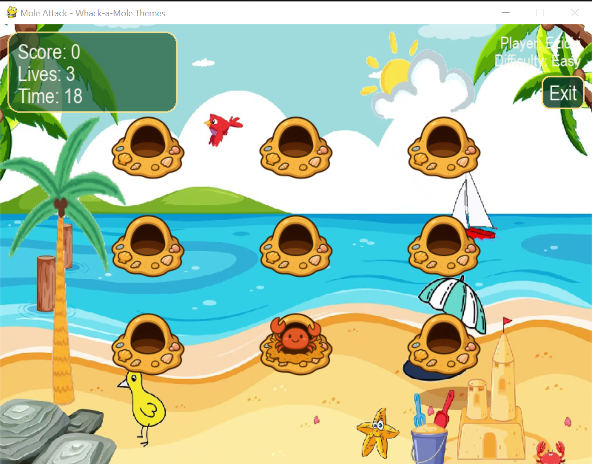
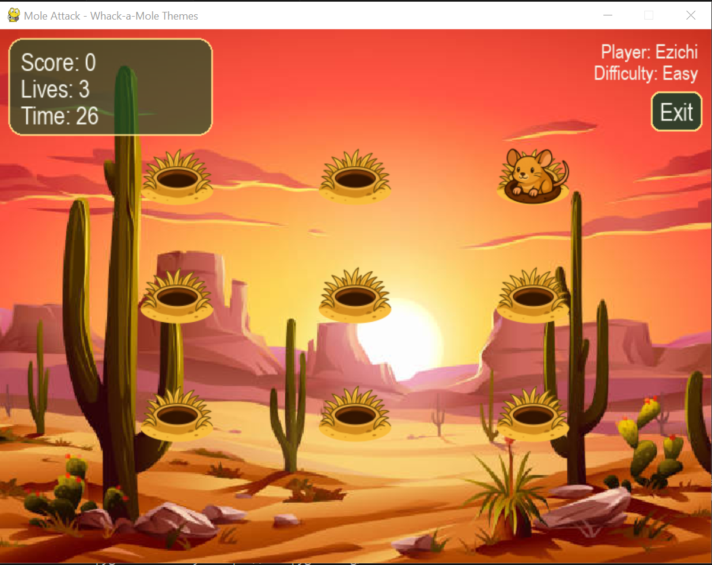
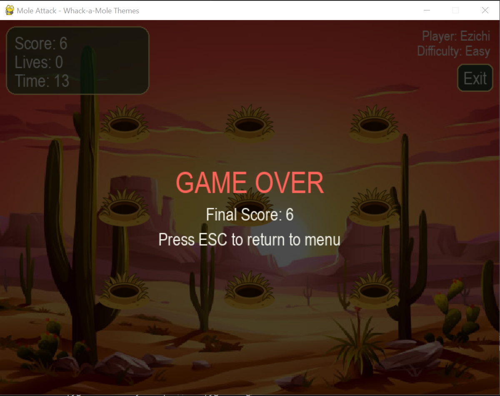

# Mole Attack

Mole Attack is a Whack-a-Mole style game built in Python using Pygame. Players score points by clicking moles that appear randomly on the screen before time runs out.

## Features

- Real-time scoring system
- Countdown timer
- Multiple difficulty levels
- Randomized mole positions
- Desktop game experience

## Technologies

- Python
- Pygame

## How to Run from Source

```bash
pip install -r requirements.txt
python main.py
```

## Download

A standalone executable is available at the link below:

https://github.com/Ezichi123/mole-attack/releases/tag/v1.0

## Screenshots





